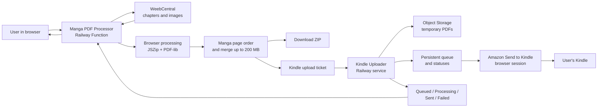

# Manga PDF Processor

Source backup for the Railway services that process manga PDFs/CBZ files,
download chapters from WeebCentral, merge manga pages for landscape reading,
and optionally send the resulting PDF files to Kindle.

## Architecture (plain-language overview)

The project is made of two Railway services and a browser interface:



### What happens during a download

1. The user selects local PDF files or chooses manga and chapters from
   WeebCentral.
2. The main app downloads and prepares the chapter PDFs when needed.
3. The browser combines pages in manga reading order: the first page of a
   spread is placed on the right, and a chapter boundary can be joined when
   appropriate.
4. The result is split into convenient PDF parts of roughly 200 MB or less.
5. The user can download a ZIP archive, or send each resulting PDF to the
   Kindle uploader.
6. The Kindle uploader stores the PDF temporarily, places it in a persistent
   queue, and sends files one at a time through Amazon Send to Kindle.
7. The main app displays the current queue counters and the final status of
   every file.

### Where data lives

- The main web app is the user-facing entry point on Railway.
- The Kindle uploader is isolated from the main app so Amazon browser
  automation and its queue can restart independently.
- The Amazon Chromium browser and its supporting display processes start only
  when a queued file or a manual connection needs them. VNC is started only
  for a manual Amazon login; all of them close again after the worker is idle.
- Kindle status polling pauses while the user-facing browser tab is hidden and
  refreshes immediately when the tab becomes visible again.
- Temporary PDFs are stored in the configured S3-compatible object storage.
- The queue and Amazon browser profile are stored on the Kindle uploader's
  persistent Railway volume.
- GitHub is the source-of-truth backup; Railway contains the running copies.

### Failure boundaries

- If WeebCentral is unavailable, chapter preparation fails without affecting
  the Kindle queue.
- If Amazon requires login again, jobs remain in `Waiting for login` and are
  retried after the session is restored.
- If one PDF fails three times, it becomes `Failed` while other jobs remain
  visible and recoverable in the queue.

### Kindle runtime lifecycle

The Kindle worker keeps only the lightweight Node.js queue process alive while
there is no work. Its heavier components are created on demand:

1. A queued PDF starts Xvfb, Fluxbox and Chromium, then the worker sends the
   document through the stored Amazon session.
2. A manual **Connect Amazon** action additionally starts the local-only VNC
   server so the Amazon login can be completed in the browser. The Amazon
   password never enters the app or Railway variables.
3. When no file is processing, no VNC client is connected and the temporary
   connection link has expired, Chromium and the display processes are closed
   after `BROWSER_IDLE_MS` (60 seconds by default).

This avoids keeping the browser, Xvfb, Fluxbox and VNC in memory all day while
retaining the persistent Amazon profile and queue on `/data`. `tini` is used as
the container init process so stopped child processes are reaped reliably.

## Services

- `work/manga-pdf-processor/index.ts` — main web app deployed on Railway as a
  Function image. Railway stores the function source in `FUNCTION_SOURCE_*`
  variables.
- `work/kindle-uploader/` — Kindle uploader worker deployed as a Docker-based
  Railway service.

## Main app environment variables

Keep values only in Railway variables, never in git:

- `APP_PASSWORD`
- `APP_SESSION_TOKEN`
- `KINDLE_WORKER_URL`
- `KINDLE_SHARED_SECRET`

## Kindle uploader environment variables

Keep values only in Railway variables, never in git:

- `KINDLE_SHARED_SECRET`
- `PUBLIC_BASE_URL`
- `APP_ORIGIN`
- `AWS_ENDPOINT_URL`
- `AWS_ACCESS_KEY_ID`
- `AWS_SECRET_ACCESS_KEY`
- `AWS_S3_BUCKET_NAME`
- `AWS_DEFAULT_REGION`
- `AWS_S3_URL_STYLE`
- `DATA_DIR`
- `BROWSER_IDLE_MS` — optional idle timeout before Chromium and its display
  runtime are stopped; defaults to `60000`.

## Checks

Run the automated checks from the repository root:

```sh
node work/runtime-optimization.test.mjs
node work/manga-pdf-processor/pdf-utils.test.mjs
node work/manga-pdf-processor/pdf-merge-contract.test.mjs
```

The first check protects the lazy-runtime contract: no X/VNC process may be
started by the container entrypoint, and the worker must start and stop the
display runtime together with browser work.

## Backup rule

After every code change, push the source to GitHub first, then deploy to
Railway. Railway is runtime state; GitHub is the source of truth.
